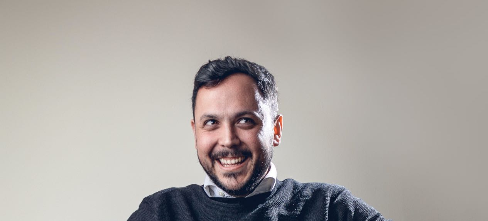
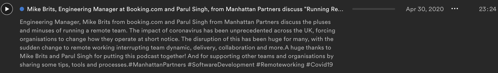
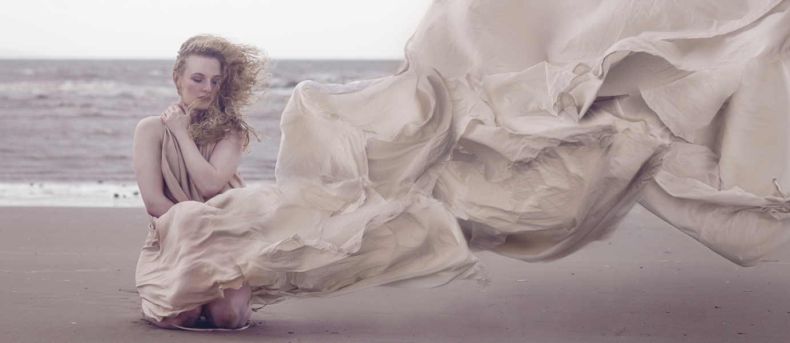

## Hey! I'm Mike 🚀

### I love solving puzzles. 
And not just riddles and brain teasers. I love solving the kinds of problems we encounter every day. That's why I love code and design. I spend the majority of my time solving puzzles or trying to find the puzzle in a boring situation.

---

### Work is a part of who I am.

I currently work for booking.com as an engineering manager. I work with a talented team of developers and together we look for front end solutions at scale. I specialise in JS with a focus on React.

---

### Side-gigs
I love having great conversations. Listen to the most recent podcast I was featured on:
 

I used to be a photographer and animator. Go have a look at some of my work:

---

### Goals for 2020-2021
🚀Publish an open source project  
🤜🤛Contribute to an open source project 
❤️ Learn about being charitable with code *(I have a cunning plan)*

